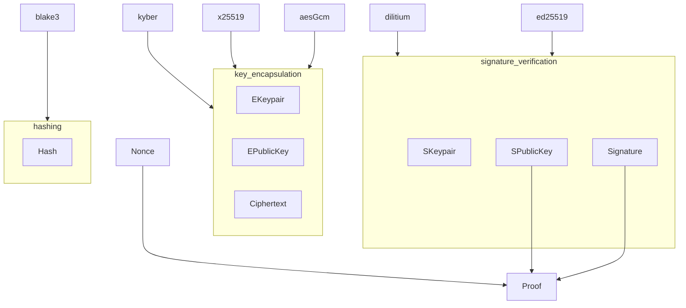
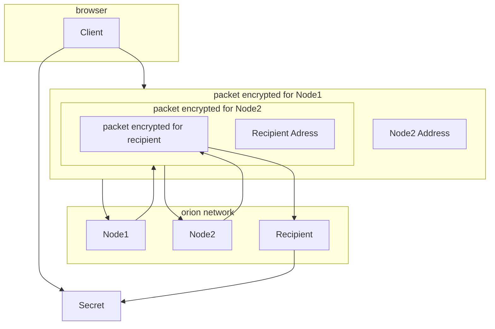
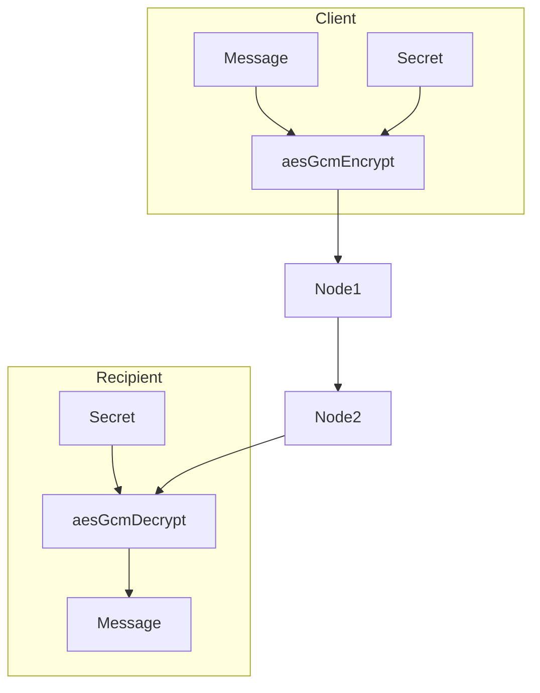
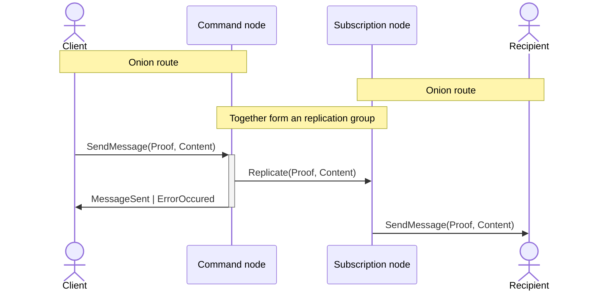
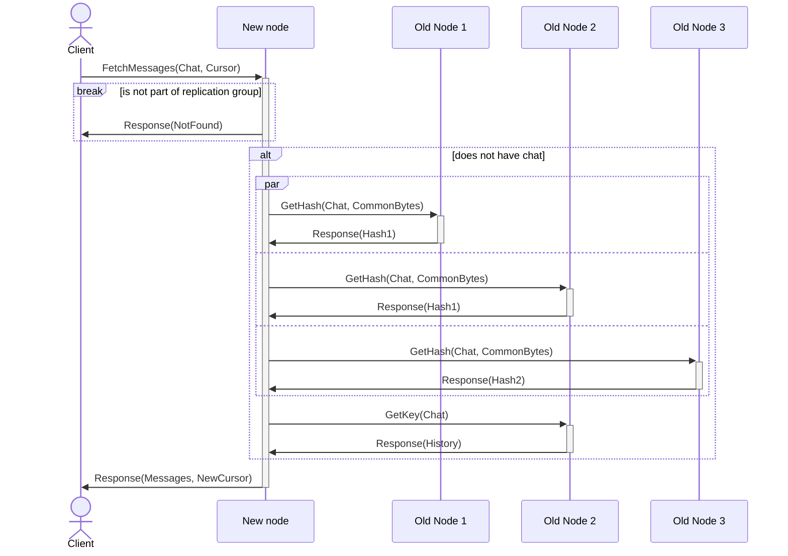
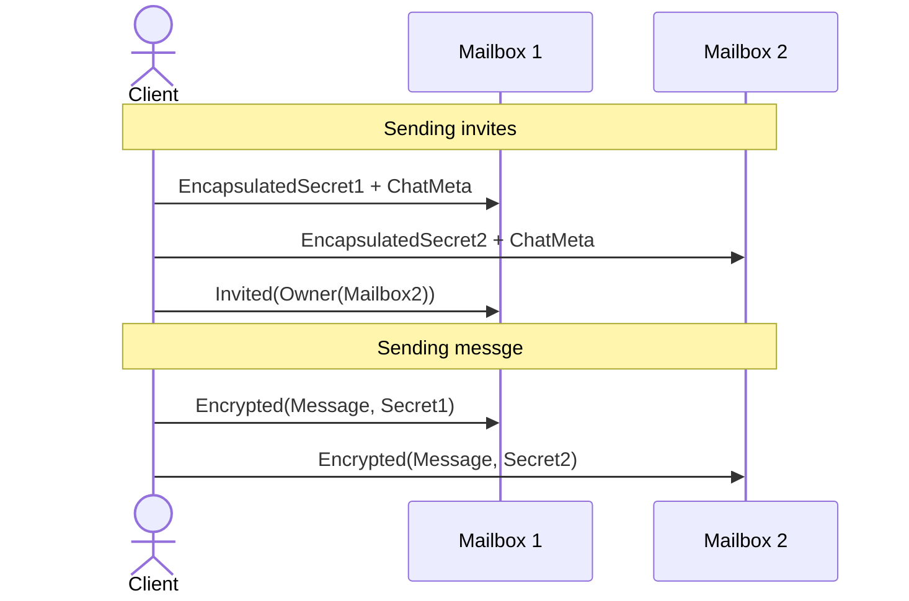

# The crypto protocols

## Fundamentals

### Core encryption primitives

### Onion routing

#### Setup

#### Communication

## Chat implementation comparison

### Central Buffer

The servers and also the recipient validate the proof attached to a message when it occurs. Problem appears when user retroactively reads the messages from the common buffer. Buffer cannot store the signatures for each message permanently since dilithium signatures are almost 5kb large. Malicious node can advertise false chat history to new nodes.

#### Lazy redistribution + Consistency voting

Lets go trough scenario where problems may occur:

- node enters/leaves the network
    - client connects to a node, since it discovers it as one of N closest nodes to data he is interested in
    - node does not have knowledge of this data due to it either being new or being pushed into replication group due to other node leaving
    - node tells client the chat does not exist (unwanted outcome)

To prevent this, requested node must verify its not supposed to have the data requested by querying closest nodes to the requested key. If the node is in fact in the group, it requests values from other nodes, majority of consistent values will be replicated and served to the client. The majority vote can be optimized to relief network bandwidth. Nodes will be sent common sequence of bytes which they combine with the hash of the value to be replicated and return that back to the requesting node. From majority matching hashes is one chosen to fetch the key.

## Message multiplexing

Previous solution assumes majority of nodes are legitimate which is traded for performance. This implementation needs only one node in replication group to be honest though cannot be scaled to as many users. Instead of servers maintaining the state of the chat, members of the chat are remembered by each user along with history of messages. When inviting a user, the cached secret key is send along with the chat metadata to invitees mailbox, other users also receive message about this to their mailboxes. When removing a member, each user will validate this for themself and remove the user from recipients -> not sending the messages for the excluded user is enough since every user has separate secret.

